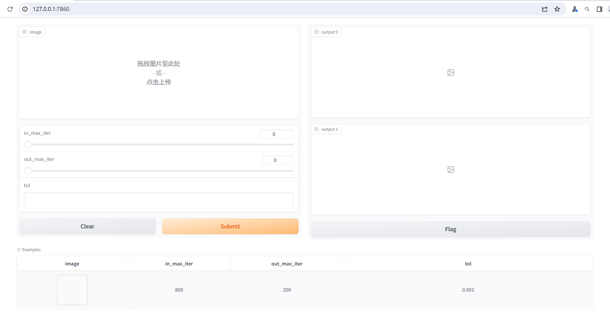

## RPCA项目介绍
### 0. 简介
本次实验主要运用基于ADMM算法（交替方向乘子法）的RPCA（Robust PCA）进行图像恢复
### 1. 实验环境搭建
本次python环境为Python 3.11.8，注意gradio版本一致性，其余包不一定需要版本完全一致。详见requirments.txt。
```
pip install gradio ==  3.50.2 -i https://pypi.tuna.tsinghua.edu.cn/simple
# 确保gradio的版本,使用清华园镜像安装
```

### 2. 程序代码运行 
实验所有代码均保存在src中，在src文件夹中打开终端，运行：
```
python run_web.py
```
得到程序运行本地端口，在Chromme或其他浏览器中打开即可。

### 3. UI界面介绍

- 图片上传只需要拖动或者选择即可，注意图片大小，图片大小在512×512、in_max_iter=3000，运行时间已经可以达到20min，
  建议输入128×128图片以减短运行时间。
- in_max_iter：ADMM算法内循环迭代最大次数，这个会很大程度影响运行时间，建立在3000以内。
- out_max_iter：ADMM算法外循环迭代最大次数，默认即可。
- tol：认为收敛对应最小误差，这里建议选择大于1e-4。
- output0：对应处理后的修复图像。
- output1：对应去掉的图像部分。

### 4. 实验效果查询
在figures文件夹中查看低秩分解效果，文件名以A开头即为恢复图，文件名以E开头为残差图。